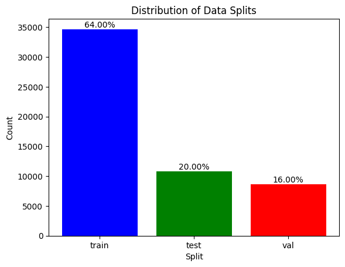

# Data

This folder contains the data used in the project. The data is scraped from [Indian Kanoon](https://indiankanoon.org/). The data is scraped using the BeautifulSoup library in Python.

## Data Distribution

Dataset is distributed as follows:

|  Dataset   | No.of Cases | Percentage |       Purpose        |
| :--------: | :---------: | :--------: | :------------------: |
|   Train    |   34,655    |    64%     |  Training the model  |
| Validation |   10,830    |    20%     | Validating the model |
|    Test    |    8,664    |    16%     |  Testing the model   |



## 📂 Directory Tree

```bash
.
├── Case_Seperator.py
├── DataScraping
│   ├── Compare_Files.py
│   ├── Data_Download.py
│   ├── Getting_links.py
│   └── README.md
├── data_unknown_label_generation.ipynb
├── EDA.ipynb
├── label_generation_multi.py
├── Merge_data.ipynb
├── missing_text.ipynb
├── preprocess.py
├── Readme.md
├── spliting.ipynb
├── unknown_cases_list.txt
├── Unknown_Splitter.ipynb
└── unkonwn-case-status_LangChain.ipynb

1 directory, 16 files
```
