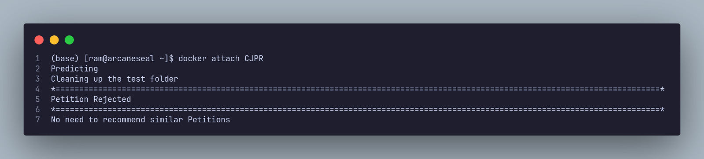
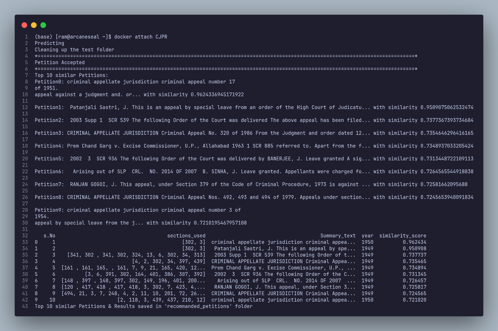

<h2 align="center">Court Judgement Prediction & Recommendation</h2>

<div align= "center">
  <h5>CJPR built on different Natural Language Processing Models using ILDC dataset from Supreme Court to make Court Judgement Prediction & Providing Recommendations.</h5>
</div>

<div align="center">
    <a href="https://www.python.org/"></a>
    
    
    
    <a href="https://github.com/Chaganti-Reddy/CJPR/issues"></a>
</div>

## :innocent: Motivation

The motivation for building this system is to provide AI-powered data-driven prediction assistance to judicial practitioners to make a better decision. To meet the demand of solving the humongous load of pending cases, we have resorted to the modern-day techniques of using ML and AI to improve the efficiency of the process. This `CJPR` system brings a wave of revolution in the legal system where with the help of this model we can provide legal practitioners better insight into the case by giving them relevant historical cases and provide assistance to them for providing a better result.

## Table of Contents

- [:star: Features](#star-features)
- [:warning: Frameworks and Libraries](#warning-frameworks-and-libraries)
- [:file_folder: Datasets](#file_folder-datasets)
  - [Data Preprocessing](#data-preprocessing)
- [:key: Prerequisites](#key-prerequisites)
- [:bulb: Recommendations](#bulb-recommendations)
- [📂 Directory Tree](#-directory-tree)
- [🚀&nbsp; Installation & Running](#nbsp-installation--running)
- [:key: Results](#key-results)
- [:notebook: Wandb](#notebook-wandb)
<!-- - [:raising_hand: Citation](#raising_hand-citation) -->
- [:beginner: Future Goals](#beginner-future-goals)
- [:eyes: License](#eyes-license)

## :star: Features

- **Prediction of Court Petitions:** CJPR is able to predict the court petitions based on the given case description.
- **Recommendation on Acceptance** CJPR is able to recommend `(If Petition is Accepted)` similar historical cases based on the given case description.
- **Easy to Access:** This system is deployed on docker and pushed to docker hub for easy access. Anyone can access this system by just pulling the docker image from docker hub & running it on their local machine.

## :warning: Frameworks and Libraries

- **[Hugging Face](https://huggingface.co/):** Hugging Face is an NLP-focused startup with a large open-source community, in particular around the Transformers library.
- **[Sci-kit Learn](https://scikit-learn.org/stable/):** Simple and efficient tools for predictive data analysis.
- **[Tensorflow](https://www.tensorflow.org/) / [Keras](https://keras.io/):** Deep learning framework used to build and train our models.
- **[Pytorch](https://pytorch.org/):** Deep learning framework used to build and train our models.
- **[Numpy](https://numpy.org/):** NumPy is a Python library used for working with arrays.
- **[Pandas](https://pandas.pydata.org/):** Pandas is a Python library used for working with data sets.
- **[Matplotlib](https://matplotlib.org/):** Matplotlib is a comprehensive library for creating static, animated, and interactive visualizations in Python.
- **[Beautiful Soup](https://www.crummy.com/software/BeautifulSoup/bs4/doc/):** Beautiful Soup is a Python library for pulling data out of HTML and XML files.
- **[Docker](https://www.docker.com/):** Docker is a set of platform as a service products that use OS-level virtualization to deliver software in packages called containers.

## :file_folder: Datasets

The Dataset used for this project is `ILDC Large` dataset. The dataset contains 54,000+ court cases from the Supreme Court of India. This data is scraped from [India Kanoon](https://indiankanoon.org/) website. `ILDC Large` only contains data from Supreme court of India. The dataset contains the following columns:

- `ID`: Unique ID for each case
- `Text`: Petiton text of the case
- `Decision`: Decision of the case (1: Accepted, 0: Rejected)
- `Label`: Label of the case (1: Criminal, 0: Civil)
- `Year`: Year of the case

Dataset is distributed as follows:

|  Dataset   | No.of Cases | Percentage |       Purpose        |
| :--------: | :---------: | :--------: | :------------------: |
|   Train    |   34,655    |    64%     |  Training the model  |
| Validation |   10,830    |    20%     | Validating the model |
|    Test    |    8,664    |    16%     |  Testing the model   |

### Data Preprocessing

Data preprocessing is an important step that improves the quality and consistency of the raw legal text data that has been collected from indiakanoon.org. The first step is to get rid of any spaces that don’t break the flow of text. After that, the data is split into lines, and each line goes through sentence-level cleaning to get rid of characters which aren’t needed. Then, abbreviations are explained in full, and any formatting problems are fixed. The main content is taken out, and checks make sure the data is correct. The final preprocessed data is gathered, which gives the next analyses a clean and solid base. All these steps are done using the python `Regular Expressions`.

## :key: Prerequisites

All the prerequisites are mentioned in the code file itself to run the code. But as the application is deployed on docker, you just need to pull the docker image from docker hub and run it on your local machine. The docker image is available on docker hub with the name `chagantireddy/cjpr:latest`. But the dependencies for the docker image are mentioned in the [requirements.txt](https://github.com/Chaganti-Reddy/CJPR/blob/main/CJPR_docker/requirements.txt) file.

## :bulb: Recommendations

The recommendations are provided based on the cosine similarity between the given case description and the historical cases. The cosine similarity is calculated using the
</br>

$$ Cosine Similarity(A,B) = \frac{\sum*{i=1} A_i . B_i}{\sqrt{\sum*{i=1} {A*i}^2}\sqrt{\sum*{i=1} {B_i}^2}} $$

Where,

$A_i$ is the $i_{th}$ component of vector $A$ & $B_i$ is the $i_{th}$ component of vector $B$.

## 📂 Directory Tree

```bash
.
├── assets
├── CJPR_docker
├── Classical
│   ├── Logistic
│   ├── Random_Forest
│   └── XGBOOST
├── Papers
├── test_cases
├── TPU
│   ├── albert
│   ├── bert
│   ├── deberta
│   ├── distilbert
│   ├── roberta
│   └── xlnet
└── Transformers-GPU
    ├── albert
    ├── bert
    ├── deberta
    ├── distilbert
    ├── roberta
    └── xlnet

23 directories
```

## 🚀&nbsp; Installation & Running

1. Pull the docker image from docker hub

```
$ docker pull chagantireddy/cjpr:latest
```

2. All the instructions to run the docker image are mentioned in the dockerhub itself for referencing purpose. But the instructions are also mentioned below.

3. If you running the image for the first time then run the following command to create a container from the image.

```
$ docker run -it --name CJPR <IMAGE_ID>
```

4. Get the Image ID using below command and then find for chagantireddy:cjpr and copy the IMAGE ID

```
$ docker images
```

5. If you have already created a container from the image then you have to copy the test data to the container from [test_cases](https://github.com/Chaganti-Reddy/CJPR/tree/main/test_cases) directory. For that run the following command.

```
$ docker cp <file_path> CJPR:/app/test
```

6. Now you can run the following command to run the application.

```
$ docker start CJPR

$ docker attach CJPR
```

7. Now your output is stored in the container itself. You can copy the output to your local machine by running the following command.

```
$ docker cp CJPR:/app/recommanded_petitions <output_path>
```

The screenshot of the application running looks like:



## :key: Results

#### The CJPR system is able to predict and recommend the test_cases which are not trained on the model. The results are shown below:



Now you can copy the results to your local machine by running the above given command.

#### 📂 Ouput Dirtectory List

```bash
.
├── Petition0.txt
├── Petition1.txt
├── Petition2.txt
├── Petition3.txt
├── Petition4.txt
├── Petition5.txt
├── Petition6.txt
├── Petition7.txt
├── Petition8.txt
├── Petition9.txt
└── result_table.csv

0 directories, 11 files
```

## :notebook: Wandb

The results of the model are stored in the [Wandb](https://wandb.ai/) for better visualization and tracking of the model. Due to its better monitoring and tracking features, we have used wandb to store the results of the model.

## :clap: And it's done!

Feel free to 📧 me for any doubts/query ([Mail to Me :smile:](chagantivenkataramireddy1@gmail.com))

---

<!-- ## :raising_hand: Citation -->
<!---->
<!-- You are allowed to cite any part of the code or our dataset. You can use it in your Research Work or Project. Remember to provide credit to the Maintainer Chaganti Venkatarami Reddy by mentioning a link to this repository and her GitHub Profile. -->
<!---->
<!-- Follow this format: -->
<!---->
<!-- - Author's name - Name -->
<!-- - Date of publication or update in parentheses. -->
<!-- - Title or description of document. -->
<!-- - URL. -->

## :beginner: Future Goals

1. To make the system more robust by adding more historical cases.
2. To use the Machine Learning based encoding techniques to encode the case description.
3. To make the system more efficient by adding more models.
4. To make the system more user friendly by adding a GUI.

## :eyes: License

Apache-2.0 © [Chaganti Reddy](https://github.com/Chaganti-Reddy/CJPR/blob/main/LICENSE)

<!-- ## Contributors

<a href="https://github.com/Chaganti-Reddy/CJPR/graphs/contributors">
  
</a> -->
